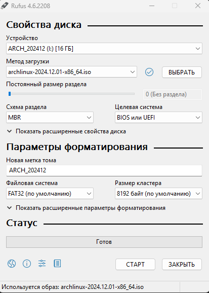
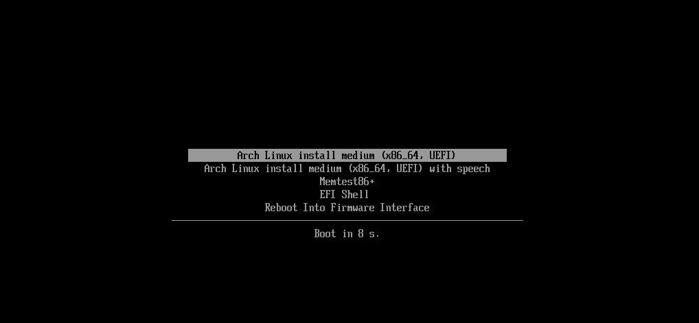

# Arch Linux

## Preparation of Installation Image
!!! note
    We want to emphasize that Linux systems can be installed almost anywhere: on a desktop, a laptop, a USB drive, or even a phone (if the distribution supports it). The installation process is roughly the same, but there are differences that need to be understood. For example, when installing Arch Linux as a second system, you'll need to manually configure efibootmgr. Additionally, there are differences in setting up dual boot on a machine with BIOS versus UEFI.
That's why guides will repeat certain steps to avoid creating confusion with too many "If you have BIOS, do this…" and "If you have UEFI, do that…" instructions scattered throughout.

What You’ll Need to Begin Installation:

- A USB flash drive
- The system’s ISO file
- A program to write the ISO image
- A machine where Arch will be installed

The installation will be done as the primary operating system.

Let's create the installer on a USB drive.

First, download the system image from the official Arch Linux website using the method that works best for you. We recommend using a Torrent client.

There are several programs that can help with this process, such as:

- Rufus
- Balena Etcher
- UltraISO (Yes, really…)

In our case, we'll use Rufus.
After downloading the image, open Rufus.

- Device: Select your **USB flash drive*.  
- Boot selection: Choose **"Disk or ISO image"** and specify the path to the Arch Linux ISO file.  
- Partition scheme: Select **MBR**.  
- File system: Choose **FAT32**.  
- Cluster size: Leave it as **default**.  



!!! IMPORTANT
    All files on the USB drive will be erased! 

- Click Start. In the pop-up window, select the option that mentions the **ISO**.

After the process is complete, connect the USB flash drive to the machine where you want to install the system.  
Enter the BIOS of the machine and disable Secure Boot (you can enable it again after the installation is complete).  
Now, we can boot from the USB. When the machine boots from the USB, you'll see a menu. Select the first option **Arch Linux install medium**, and wait for the system to load.



## Installation

### Network settings

Setting Up a Wireless Network

If you are connected via a wired connection, simply check if it works using the following command:

```bash
ping archlinux.org
```

If you get a response, everything is fine. If not, it means the required service didn't start. Try restarting the machine or re-creating the installation image. We will use the iwctl utility.

Execute the command:

```bash
iwctl
```


Then enter the following commands:

1. List available wireless devices:

```bash
device list
```

*Identify the name of your wireless device (e.g., wlan0).*

2. Scan for available networks:

```bash
station wlan0 scan
```

3. View the list of available networks:

```bash
station wlan0 get-networks
```

4. Connect to a Wi-Fi network:

```bash
station wlan0 connect {network}
```

*After this command, you will need to enter the password if the network is secured.*

5. Check the connection status:

```bash
station wlan0 show
```

Ensure the network is connected.

```bash
ping archlinux.org
```

### Disk Partitioning

There are two utilities for disk partitioning:

- **fdisk**
- **cfdisk**

We gonna use `fdisk`, which is simpler to use and more user-friendly for inexperienced users.

First, let's determine the name of our disk.

!!! IMPORTANT
    It is recommended to disconnect any unnecessary disks to avoid confusion and the accidental loss of data due to inexperience.

Use the following command to determine the name of your disk:

```bash
fdisk -l
```

This will output a list of connected disks. 

Run the following command to configure your disk:  

```bash
fdisk /dev/nvme0n1
```

We need to create three partitions:

| Partition |   Size          | Type              |
| :---      |     :---:       |              ---: |
| boot      | 1G              |  Efi-system       |
| swap      | 8G              |  linux swap       |
| root      | Remaining space |  linux filesystem | 

Press ++p++ to list partitions in selected disk, if any exists.

Press ++n++ to create a new partition. Partition numbers should be left as default. Leave the **First sector** as default by pressing ++enter++ and allocate `+1G` for **Last sector**. We just created `boot` partition.

Do same steps for `swap` by allocating 4-8G (if you want) and all remaining space for `root`.

!!! IMPORTANT
    SWAP is the swap partition; it is recommended to include it if your machine has less than 8 GB of RAM.

After creating all partitions, press ++w++ to apply the changes.

### Archinstall

Okay, we’re done with partitioning the disk. Now, let’s proceed with installing Arch with all the components.

**Enter** and **wait**:

```bash
archinstall   
```

We will be greeted with the following menu.


Let's go step by step through the process of installing Arch Linux using the installer:

**Locale**

*Here, you can add the language to be used in the system.*

- Select Locale language and search for the desired language. You may choose `ru_RU` if you need so.

!!! Note 
    To quickly search, you can press ? and type the language you need, such as en or ru.

**Disk configuration**

- Select `Manual Partitioning`.

- Choose your disk, in our case `nvme0n1`.

- Select 1G partition. Assing mountpoint: `/boot`. Select mark/unmark to be formatted. Change filesystem to `fat32`.

- Select partition with all remaining disk space. Assing mountpoint: `/`. Select mark/unmark to be formatted. Change filesystem to `ext4`.

- Press `Confirm and exit`.

**Bootloader**

- Select `GRUB`

**Hostname**

*Name is used as the computer’s network name*.

- Enter the **name** for your system (you can leave it as archlinux).

**Root password**

*Set a password for the root user*.

- Enter the **password** and **confirm it**.

**User account**

*Add a new user account*.

- Enter a **username**.

- Enter a **password** for the user.

*You will be prompted to confirm the addition of superuser privileges (sudo)*.

- Select `Yes` to confirm.

**Profile**

*Choose a GUI for your Arch installation*.

- Press `Type`.

- Select `Desktop`.

- Choose `KDE plasma`.

- Choose `sddm`

Choose a desktop environment that suits you. It is recommended to choose **KDE Plasma**.

You will be redirected to the next menu.

You may choose the appropriate Graphics driver based on your system configuration, but leave as default (All).

**Network configuration**

- Choose `Use NetworkManager`

**Additional packages**

*Add additional programs that you might find useful*.

For now, let’s add:

`nano firefox btop`

**Timezone**

*Choose your time zone.*

!!! Note
    For quick search, press ? and type your desired time zone.

**Audio**

Select `pipewire`.

**Installing Arch**

After the pre-installation setup, select `Install`.

Then select `Yes` and wait for the installation to complete.

Once the installation is complete. After the installation is complete, we are prompted to continue the setup in chroot. Select `Yes`.

### GRUB configuration

*Now, let's set up grub*. 

As we can see there is not arch in boot manager by running the command:

```bash
efibootmgr
```

Modify the configuration:

```bash
grub-install --target=x86_64-efi --efi-directory=/boot --recheck
```

If successful, `Installation finished. No errors reported` will appear.

Re-check as arch entry had to appear:

```bash
efibootmgr
```

Finally: 
```bash
reboot
```

## Dual-boot

If you need to add Windows boot entry for dual-boot, firstly enter root user:

```bash
sudo su
```

Install OS-prober:

```bash
pacman -S os-prober
```

Edit grub config:

```bash
nano /etc/default/grub
```

Scroll to the bottom and uncomment the following

```bash title="grub" hl_lines="3"
#GRUB_SAVEDEFAULT=true
#GRUB_DISABLE_SUBMENU=y
GRUB_DISABLE_OS_PROBER=false
```

Press ++ctrl+x++, ++y++ and ++enter++.

Now you need to check the Windows Boot manager entry:

```bash
os-prober
```

Generate grub configuration file:

```bash
grub-mkcofnig -o /boot/grub/grub.cfg
```

Should be good to good, if debug messages say so.

The REAL final reboot:

```bash
reboot
```

## Linux goodies

| Application | Description |
| ----------- | ----------- |
| [Blue Screen of Life](https://github.com/harishnkr/bsol) | Menu styled like the Windows Blue Screen of Death, but family-friendly | 
| [Arch Linux Gangster Edition Plymouth theme](https://github.com/dj-no/arch-gangster-edition-plymouth?tab=readme-ov-file) | Windows XP boot screen styled as gangsta. You a real gangsta, bro? | 
| [macOS Boot Splash Style](https://www.pling.com/p/2106821) | Apple minimalism at its finest. Trendy and stylish | 
| [Plymouth Themes](https://www.pling.com/p/2216301) | A pack of multiple boot animations |