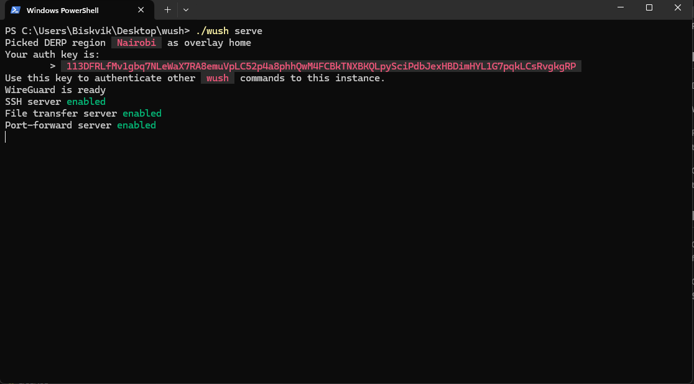
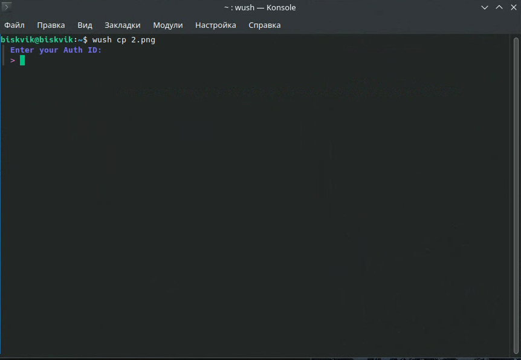
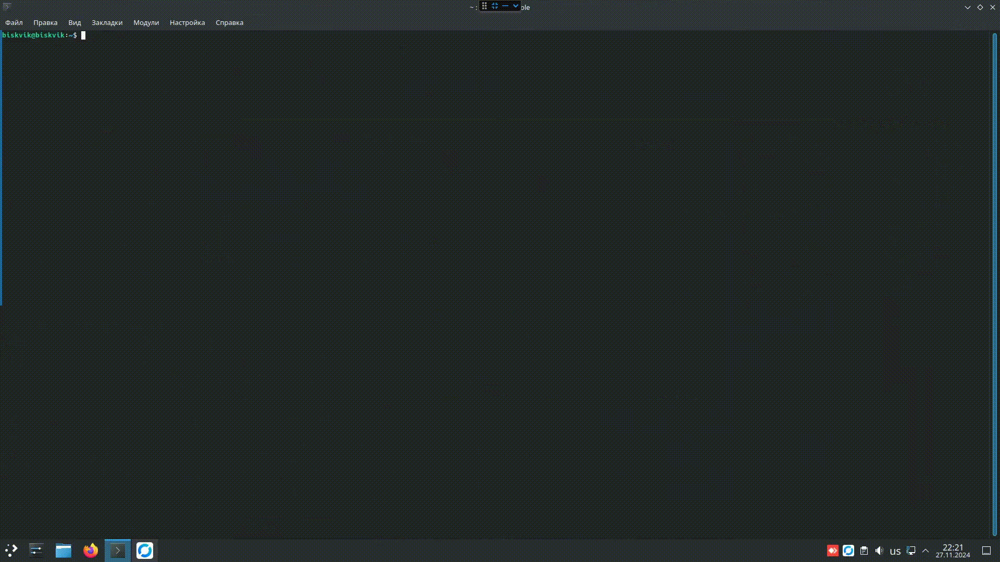

# Wush

## Who is this Wush? 

Wush - wush is a command line tool that lets you easily transfer files and open shells over a peer-to-peer WireGuard connection. It's similar to magic-wormhole but: 

1. No requirement to set up or trust a relay server for authentication.  
2. Powered by WireGuard for secure, fast, and reliable connections.  
3. Automatic peer-to-peer connections over UDP.  
4. Endless possibilities; rsync, ssh, etc.  

## Commands

**USAGE:** 

**Wush** subcommand

Start the wush server:          

```bash
wush serve
```

Open a shell to the wush host:  

```bash
wush ssh 
```

Transfer files to the wush host using rsync:  

```bash
wush rsync local-file.txt :/path/to/remote/file  
```

Copy a single file to the host:  

```bash
wush cp local-file.txt  
```

**SUBCOMMANDS:**
|     Command     |          Meaning           | 
|-----------------|----------------------------|
| `cp`            | Transfer files.            |   
| `port-forward`  | Transfer files.            |
| `rsync`         | Transfer files over rsync. | 
| `serve`         | Run the wush server.       |
| `ssh`           | Open a shell.              | 
| `version`       | Show wush version.         | 

**OPTIONS**:  

```bash
wush --version bool 
```

Print the version and exit.


## Install

Download file from [Git](https://github.com/coder/wush/releases/tag/v0.3.0)

We tested the program using machines running *Windows* and *Linux* (with a GUI).

For *Windows*: Extract the files to a folder and drive of your choice. Files that we will be transferring will be sent to/from there.

On *Linux*, installation is done using the method that works best for you. Files (at least for us) were saved/sent to/from the Home directory.

## How to use

Now let's transfer a PNG file from one machine to another. In our case, Windows will act as the host, and Linux will be the client.  
To do this, open **CMD** from the folder where **Wush** is located. Then, enter the following commands:

**Obtain the host machine's auth key using the following command:** 

```bash
./Wush serve 
```


*Copy `Auth key`*

**Now, on the client machine, enter the command to send the file:**

```bash
wush cp 2.png
```


**`2.png`* is the file that we want to send from Linux to Windows.*  

**In the client console, we paste the key that was obtained earlier on the host machine.**


How looking it




**Well Done**

## SSH

You can also use Wush for remote access to a machine's console.
The connection is also established using an Auth key.

Use the following commands:

For hosts  

```bash
Wush serve
```

For client 

```bash
Wush ssh
```

## 

> *Source* - [GitHub Coder-Wush](https://github.com/coder/wush)